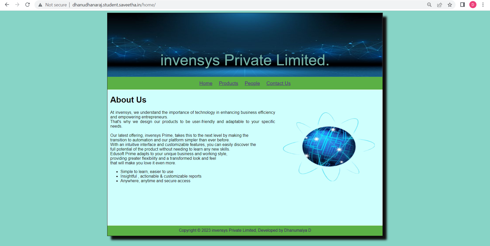
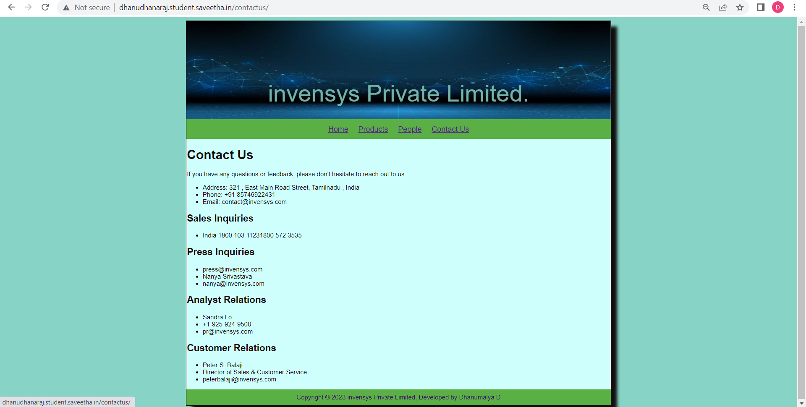
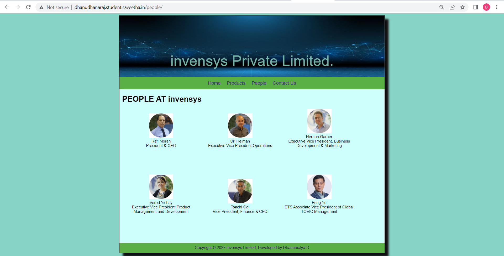
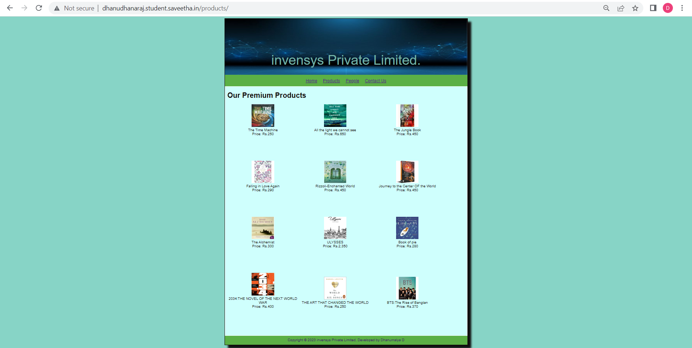

# Web Design for a Software Product Company

## AIM:

To design a static website for a software product company company.

## DESIGN STEPS:

### Step 1:

Requirement collection.

### Step 2:

Creating the layout using HTML and CSS.

### Step 3:

Updating the sample content.

### Step 4:

Choose the appropriate style and color scheme.

### Step 5:

Validate the layout in various browsers.

### Step 6:

Validate the HTML code.

### Step 7:

Publish the website in the given URL.

## PROGRAM :

## CSS Layout
```
* {
  box-sizing: border-box;
  font-family: Arial, Helvetica, sans-serif;
}
body {
  background-color: #87d4c6;
  color: #0f0707
  
}
.container {
  width: 1080px;
  margin-left: auto;
  margin-right: auto;
  border-width: 1px 1px 1px 1px;
  border-style: solid;
  box-shadow: 15px 15px 8px rgb(15, 14, 14);
}

.banner {
  display: block;
  width: 100%;
  height: 250px;
  text-align: center;
  font-size: 60px;
  background-image: url("/static/images/11.jpg");
  background-size: 100% 100%;
  margin: 0px 0px 0px 0px;
  padding-top: 150px;
  color: #74b3a8;
}

.menu {
  display: block;
  width: 100%;
  height: 50px;
  font-size: larger;
  background-color: #5bb045;
  text-align: center;
  padding-top: 15px;
  margin: 0px 0px 0px 0px;
  border-width: 1px;
}

.menuitem {
  display: inline-block;
  margin-left: 10px;
  margin-right: 10px;
}
.menuitemselected {
  display: inline-block;
  margin-left: 10px;
  margin-right: 10px;
  color: #16d1ae;
}

.menuitem a {
  text-decoration: none;
  color: #2f45c4;
}

.content {
  display: block;
  width: 100%;
  background-color: #cffffd;
  min-height: 500px;
  margin: 0px 0px 0px 0px;
  border-width: 1px;
  border-color: white;
  border-style: solid;
}
.homecontent {
  min-height: 500px;
  margin: 10px 10px 10px 10px;
}
.homecontent h1 {
  text-align: left;
}
.homecontent img {
  float: right;
  width: 400px;
  height: 300px;
  margin-left: 10px;
}

.contenttext {
  text-align: justify;
}

.productcontent {
  min-height: 500px;
  margin: 10px 10px 10px 10px;
}

.productcontent h1 {
  text-align: left;
}

.productitems {
  display: block;
}

.productitem {
  display: inline-block;
  width: 30%;
  height: 250px;
  text-align: center;
}

.productitem img {
  width: 100px;
  height: 100px;
  display: block;
}
.productitem .itemimage {
  display: block;
  margin-left: auto;
  margin-right: auto;
  width: 100px;
  margin-bottom: 5px;
}

.productitem .itemname {
  display: block;
}
.productitem .itemprice {
  display: block;
}

.footer {
  display: block;
  width: 100%;
  height: 40px;
  background-color: #5bb045;
  text-align: center;
  padding-top: 10px;
  margin: 0px 0px 0px 0px;
  color: #3c0a6b;
}
```
## home.html
```
<!DOCTYPE html>
<html lang="en">
  <head>
    <title>invensys Private Limited</title>


    <link rel="stylesheet" href="/static/layout.css">
    <link rel="icon" href="/static/11.jpg" type="image/x-icon">
  </head>

  <body>
    <div class="container">
      <div class="banner">invensys Private Limited.</div>

      <div class="menu">
        <div class="menuitemselected"><a href="/home/">Home</a></div>
        <div class="menuitemselected"><a href="/products/">Products</a></div>
        <div class="menuitemselected"><a href="/people/">People</a></div>
        <div class="menuitemselected"><a href="/contactus/">Contact Us</a></div>
      </div>
      <div class="content">
        <div class="homecontent">
          <h1>About Us</h1>
          
          <div class="contenttext">
            At invensys, we understand the importance of technology in enhancing business efficiency and empowering entrepreneurs.<br>
            That's why we design our products to be user-friendly and adaptable to your specific needs.<br><br>
            Our latest offering, invensys Prime, takes this to the next level by making the <br>
            transition to automation and our platform simpler than ever before.<br>
            With an intuitive interface and customizable features, you can easily discover the <br>
            full potential of the product without needing to learn any new skills.<br>
            Edusoft Prime adapts to your unique business and working style,<br>
            providing greater flexibility and a transformed look and feel<br>
            that will make you love it even more.<br>


            <ul>
              <li>Simple to learn, easier to use</li>
              <li>Insightful , actionable & customizable reports</li>
              <li>Anywhere, anytime and secure access</li>
            </ul>
          </div>
        </div>
      </div>
      <div class="footer">
        Copyright &#169; 2023 invensys Private Limited, Developed by Dhanumalya D
      </div>
    </div>
  </body>
</html>
```
## contactus.html
```
<!DOCTYPE html>
<html lang="en">
  <head>
    <title>invensys Private Limited</title>
   <link rel="stylesheet" href="/static/layout.css">
    <link rel="icon" href="/static/1.jpg" type="image/x-icon">
     
  </head>

  <body>
    <div class="container">
      <div class="banner">invensys Private Limited.</div>
      <div class="menu">
        <div class="menuitemselected"><a href="/home/">Home</a></div>
        <div class="menuitemselected"><a href="/products/">Products</a></div>
        <div class="menuitemselected"><a href="/people/">People</a></div>
        <div class="menuitemselected"><a href="/contactus/">Contact Us</a></div>
      </div>
      <div class="content">
          
            <h1>Contact Us</h1>
  <p>If you have any questions or feedback, please don't hesitate to reach out to us.</p>
  <ul>
    <li>Address: 321 , East Main Road Street, Tamilnadu , India</li>
    <li>Phone: +91 85746922431</li>
    <li>Email: contact@invensys.com</li></ul>
  
<h2> Sales Inquiries</h2>

<ul><li>India 1800 103 11231800 572 3535</li></ul>
    <h2>Press Inquiries</h2> 
<ul><li>press@invensys.com</li>

<li>Nanya Srivastava</li>
<li>nanya@invensys.com</li></ul>
    <h2>Analyst Relations</h2> 

    <ul><li>Sandra Lo</li>
    <li>+1-925-924-9500</li>
    <li>pr@invensys.com</li></ul>
        <h2>Customer Relations</h2> 

    <ul><li>Peter S. Balaji</li>
    <li>Director of Sales & Customer Service</li>
    <li>peterbalaji@invensys.com</li>
    </ul>
    
  </div>
   <div class="footer">
        Copyright &#169; 2023 invensys Private Limited, Developed by Dhanumalya D
      </div>
      </div>
</body>
</html>
```
## people.html
```
<!DOCTYPE html>
<html lang="en">
  <head>
    <title>invensys Private Limited</title>

     <link rel="stylesheet" href="/static/layout.css">
    <link rel="icon" href="/static/icon.png" type="image/x-icon">

  </head>

  <body>
    <div class="container">
      <div class="banner">invensys Private Limited.</div>
      <div class="menu">
        <div class="menuitemselected"><a href="/home/">Home</a></div>
        <div class="menuitemselected"><a href="/products/">Products</a></div>
        <div class="menuitemselected"><a href="/people/">People</a></div>
        <div class="menuitemselected"><a href="/contactus/">Contact Us</a></div>
      </div>
      <div class="content">
        <div class="productcontent">   
          <h1>PEOPLE AT invensys</h1>
          <div class="productitems">
              <div class="productitem">
                  <div class="itemimage">
                  
                  </div>
                  <div class="itemname">Rafi Moran</div>
                  <div class="itemprice">President & CEO</div>
              </div>
              <div class="productitem">
                  <div class="itemimage">
                  
                  </div>
                  <div class="itemname">Uri Heiman</div>
                  <div class="itemprice">Executive Vice President Operations</div>
              </div>
              <div class="productitem">
                  <div class="itemimage">
                  
                  </div>
                  <div class="itemname">Hernan Garber</div>
                  <div class="itemprice">Executive Vice President, Business Development & Marketing</div>
              </div>
              <div class="productitem">
                  <div class="itemimage">
                  
                  </div>
                  <div class="itemname">Vered Yishay</div>
                  <div class="itemprice">Executive Vice President Product Management and Development</div>
              </div>
              <div class="productitem">
                  <div class="itemimage">
                  
                  </div>
                  <div class="itemname">Tsachi Gal</div>
                  <div class="itemprice">Vice President, Finance & CFO</div>
              </div>
              <div class="productitem">
                  <div class="itemimage">
                  
                  </div>
                  <div class="itemname">Feng Yu</div>
                  <div class="itemprice">ETS Associate Vice President of Global TOEIC Management</div>
              </div>

          </div>
          </div>       
      </div>
      <div class="footer">
        Copyright &#169; 2023 invensys Limited, Developed by Dhanumalya D
      </div>
    </div>
  </body>
</html>
```
## product.html
```
<!DOCTYPE html>
<html lang="en">
  <head>
    <title>invensys Private Limited</title>
     <link rel="stylesheet" href="/static/layout.css">
    <link rel="icon" href="/static/11.jpg" type="image/x-icon">

  </head>

  <body>
    <div class="container">
      <div class="banner"> invensys Private Limited.</div>
      <div class="menu">
     <div class="menuitemselected"><a href="/home/">Home</a></div>
        <div class="menuitemselected"><a href="/products/">Products</a></div>
        <div class="menuitemselected"><a href="/people/">People</a></div>
        <div class="menuitemselected"><a href="/contactus/">Contact Us</a></div>
      </div>
      <div class="content">
        <div class="productcontent">   
          <h1>Our Premium Products</h1>
          <div class="productitems">
              <div class="productitem">
                  <div class="itemimage">
                  
                  </div>
                  <div class="itemname"> The Time Machine</div>
                  <div class="itemprice">Price: Rs.250 </div>
              </div>
              <div class="productitem">
                  <div class="itemimage">
                  
                  </div>
                  <div class="itemname">All the light we cannot see</div>
                  <div class="itemprice">Price: Rs.650 </div>
              </div>
              <div class="productitem">
                  <div class="itemimage">
                  
                  </div>
                  <div class="itemname">The Jungle Book</div>
                  <div class="itemprice">Price: Rs.450 </div>
              </div>
              <div class="productitem">
                  <div class="itemimage">
                  
                  </div>
                  <div class="itemname">Falling in Love Again</div>
                  <div class="itemprice">Price: Rs.290 </div>
              </div>
              <div class="productitem">
                  <div class="itemimage">
                  
                  </div>
                  <div class="itemname">Rizzoli-Enchanted World</div>
                  <div class="itemprice">Price: Rs.450 </div>
              </div>
              <div class="productitem">
                  <div class="itemimage">
                  
                  </div>
                  <div class="itemname">Journey to the Center OF the World</div>
                  <div class="itemprice">Price: Rs.450 </div>
              </div>
              <div class="productitem">
                  <div class="itemimage">
                  
                  </div>
                  <div class="itemname">The Alchemist</div>
                  <div class="itemprice">Price: Rs.300 </div>
              </div>
              <div class="productitem">
                  <div class="itemimage">
                  
                  </div>
                  <div class="itemname">ULYSSES</div>
                  <div class="itemprice">Price: Rs.2,350 </div>
              </div>
              <div class="productitem">
                  <div class="itemimage">
                  
                  </div>
                  <div class="itemname">Book of pie</div>
                  <div class="itemprice">Price: Rs.280 </div>
              </div>
              <div class="productitem">
                  <div class="itemimage">
                  
                  </div>
                  <div class="itemname">2034:THE NOVEL OF THE NEXT WORLD WAR</div>
                  <div class="itemprice">Price: Rs.400 </div>
              </div>
              <div class="productitem">
                  <div class="itemimage">
                  
                  </div>
                  <div class="itemname">THE ART THAT CHANGED THE WORLD</div>
                  <div class="itemprice">Price: Rs.250 </div>
              </div>
              <div class="productitem">
                  <div class="itemimage">
                  
                  </div>
                  <div class="itemname">BTS:The Rise of Bangtan</div>
                  <div class="itemprice">Price: Rs.370 </div>
              </div>
          </div>
          </div>       
      </div>
      <div class="footer">
        Copyright &#169; 2023 invensys Private Limited, Developed by Dhanumalya D
      </div>
    </div>
  </body>
</html>
```

## OUTPUT:





## RESULT:
Thus a website is designed for the software product company and the HTML,CSS code are validated.